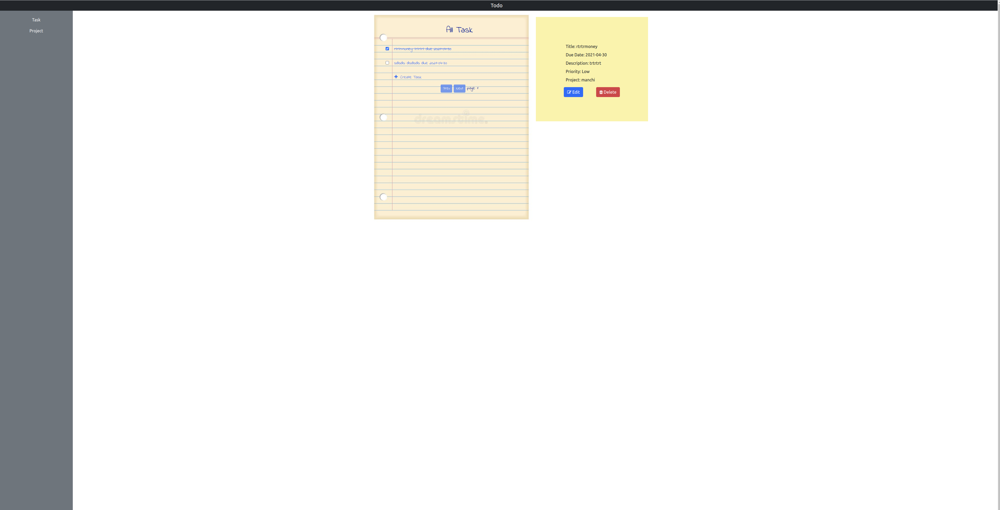
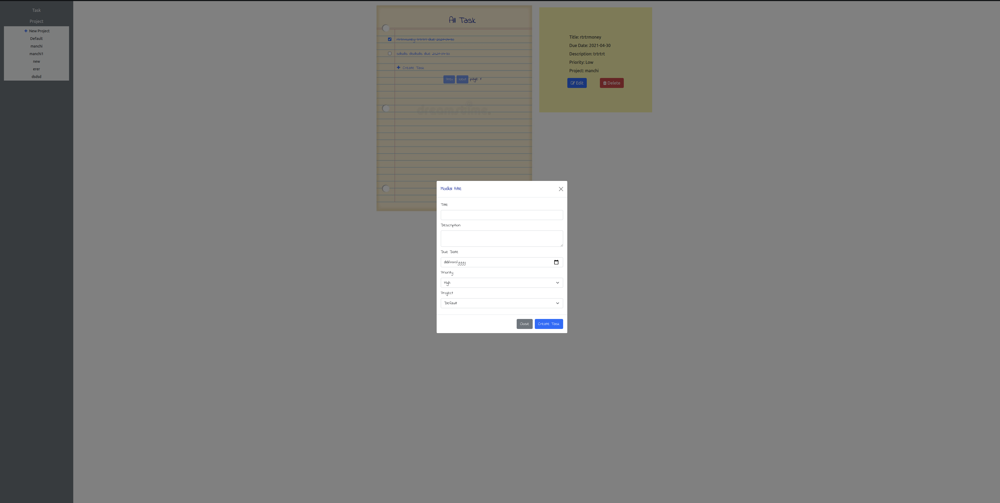

# Todo-list-Js
Microverse Javascript Curriculum
## About the app

This is a Microverse project, and this time I was required to create a todo list to put into practice the ES6 and functional programming.
In this project users can create a project, inside a project, you can create a todo, you can select priority as high, medium , or low.
## Live Demo

You can find the demo [here](https://relaxed-kirch-dbad3a.netlify.app)
## Screenshots




## Getting Started

## Setup

To get started, you should first get this file in your local machine by cloning or forking this project or typing in your terminal

> git clone https://github.com/Ceejayski/Todo-list-Js

> cd todo-list

> npm install webpack webpack-cli --save-dev

> npn install

Just run the command below for webpack to compile the code.

> npx webpack --watch

## Contributing

Contributions, issues and feature requests are welcome! Start by:

Forking the project

Cloning the project to your local machine

cd into the project directory

> cd todo-list

> Run git checkout -b your-branch-name

Make your contributions

Push your branch up to your forked repository

Open a Pull Request with a detailed description to the development branch of the original project for a review

---

Built With

This project was built using these technologies.

```
Javascript

Webpack

HTML/CSS

Bootstrap

ESlint

VSCode editor

Git

Github
```

## 👨🏿‍💻 Creator

👤 **Author1**

- Github: [@ceejayski](https://github.com/ceejayski)
- LinkedIn: [LinkedIn](https://www.linkedin.com/in/okoli-ceejay/)
- Twitter: [Twitter](https://twitter.com/OkoliChijioke10)


## Contributions

Contributions, issues and requests are welcome

## Show support

Give a star if you like the project
